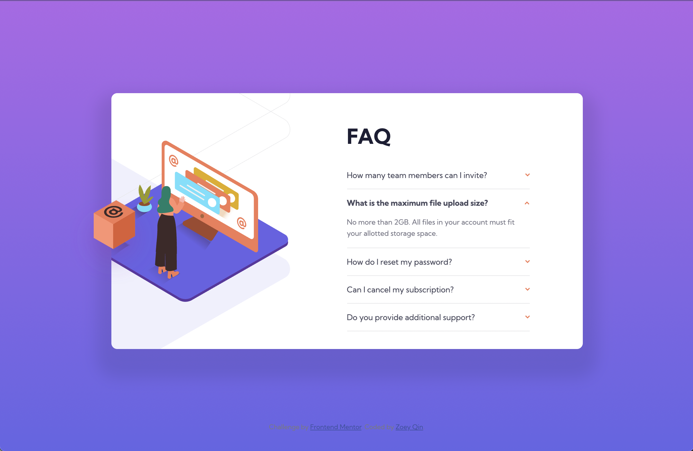
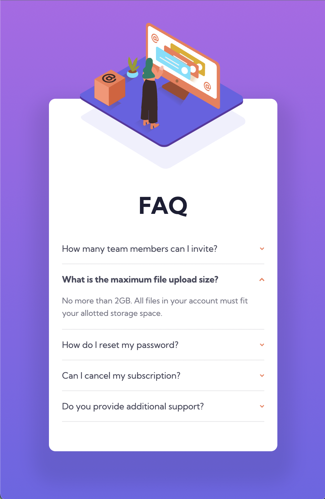

# Frontend Mentor - FAQ accordion card

## The challenge

Your users should be able to:

- View the optimal layout for the component depending on their device's screen size
- See hover states for all interactive elements on the page
- Hide/Show the answer to a question when the question is clicked