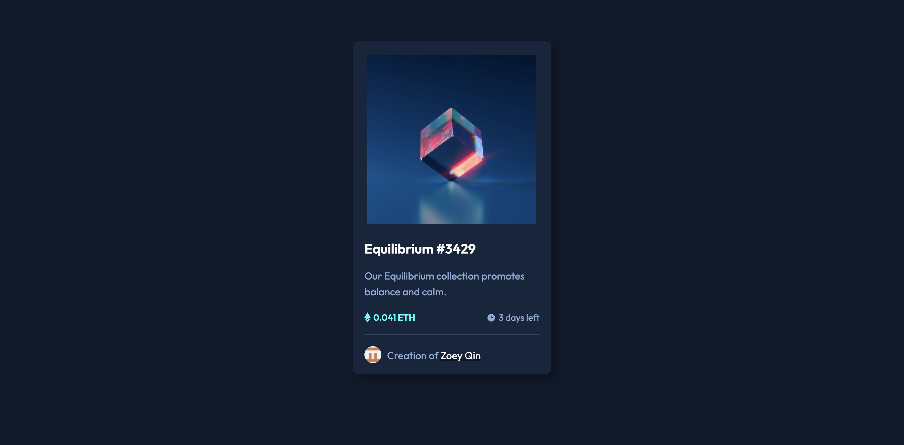
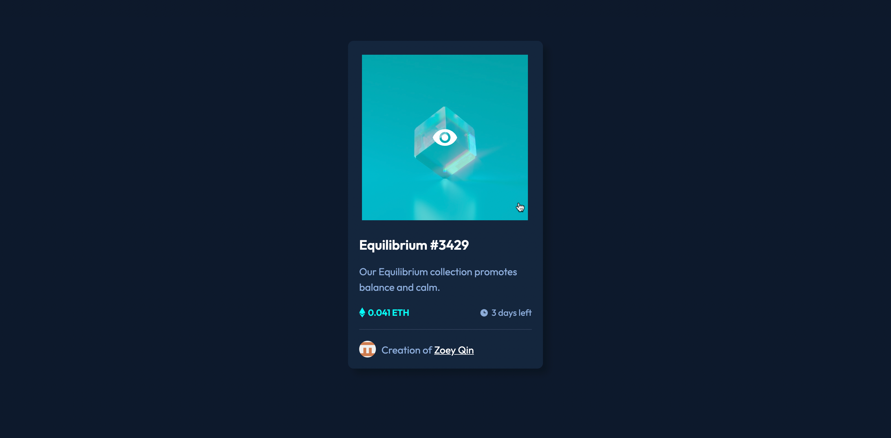

# Frontend Mentor - NFT preview card component

## The challenge

The challenge is to build out this preview card component and get it looking as close to the design as possible.

Your users should be able to:

- View the optimal layout depending on their device's screen size
- See hover states for interactive elements